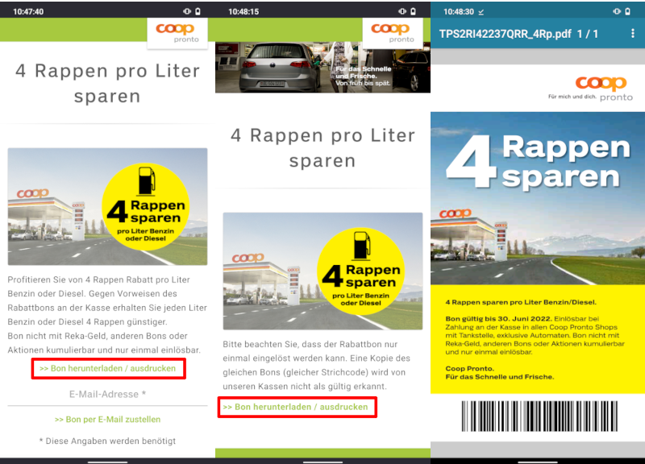

# Erklärung

Auf der Webseite [Coop Pronto - Newsletter](https://bon.coop-pronto.ch/de/start/newsletter) kann man sich einen 4 Rappen Rabattbon zum Tanken holen.
Dazu klickt man zwei Mal auf `>> Bon herunterladen / ausdrucken` ohne Angabe einer E-Mail Adresse und erhält den Bon im PDF-Format.

Diese Android-App macht das selbe, nur automatisiert.

# Installation

[APK-Datei](https://github.com/rar0ch/ProntoRabatt/releases/download/v1.0/ProntoRabatt.apk) herunterladen, die Option "Unbekannte Herkunft" aktivieren und App installieren
